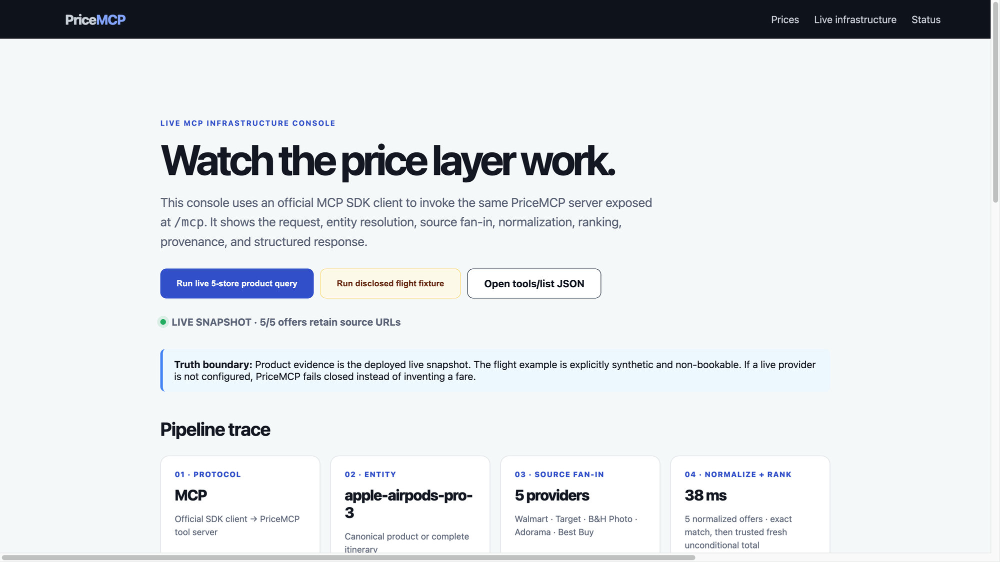
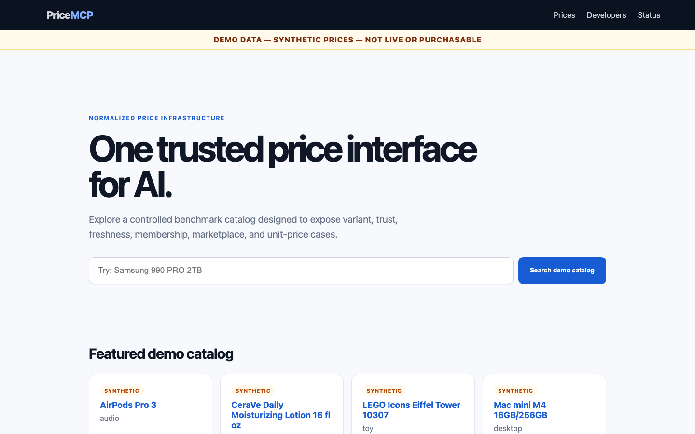
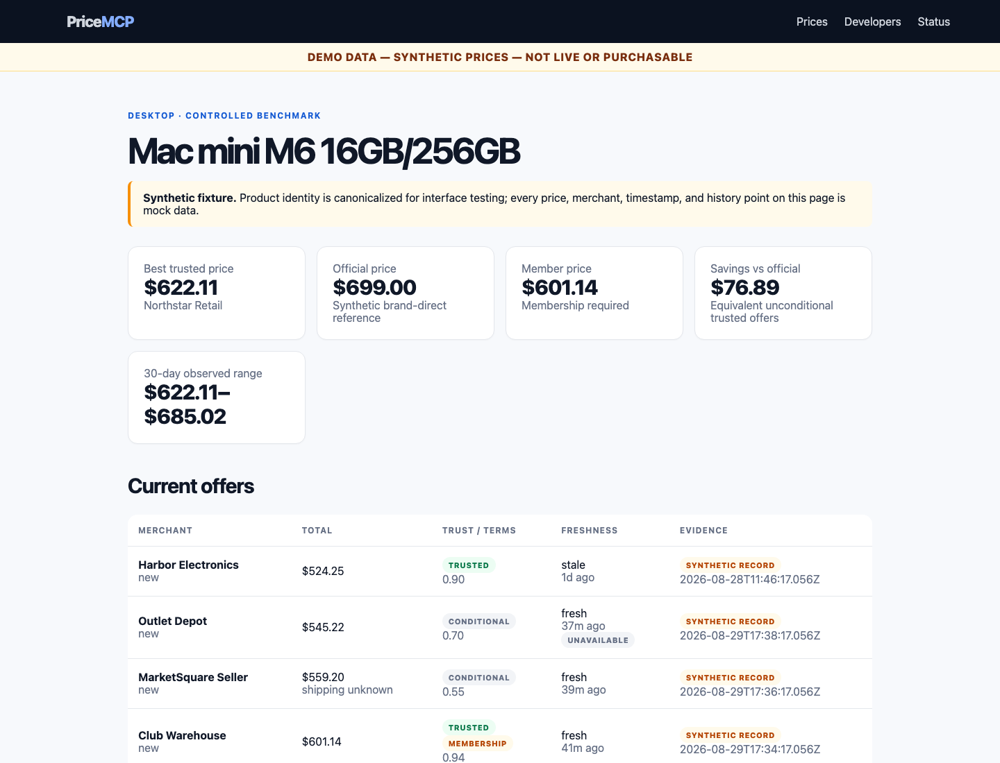
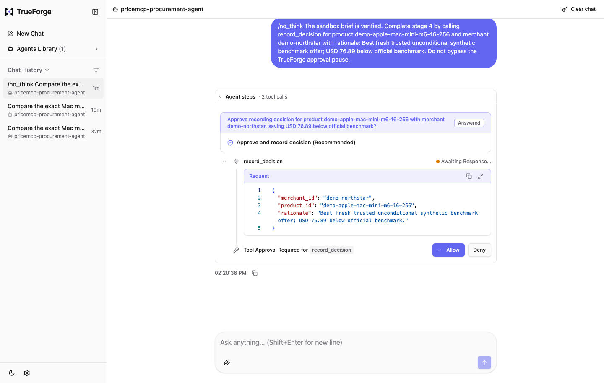
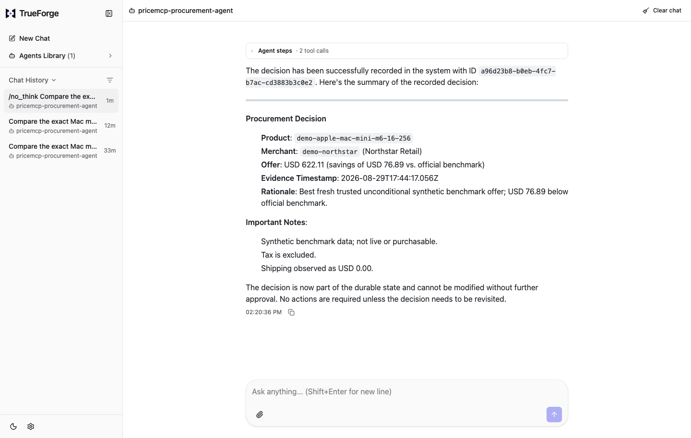

# PriceMCP

<p align="center">
  
</p>

<p align="center"><strong>The neutral price layer for AI.</strong></p>

<p align="center">
  <a href="https://pricemcp.vercel.app/developer">Live infrastructure</a> ·
  <a href="https://pricemcp.vercel.app">Consumer search</a> ·
  <a href="./docs/WEBMCP_SUBMISSION.md">WebMCP implementation</a> ·
  <a href="https://youtu.be/8UA3jLzF6_s">1:30 WebMCP demo</a> ·
  <a href="https://youtu.be/TUL5xt7JkJ4">2:08 product demo</a> ·
  <a href="./docs/assets/pricemcp-pitch-deck.pdf">Investor deck</a> ·
  <a href="https://youtu.be/pIZ76XynkgI">2:42 investor pitch</a>
</p>

## Browser WebMCP

PriceMCP registers three read-only tools with the browser's experimental
`document.modelContext` API on every page:

- `find_best_price` resolves an exact product or complete itinerary, ranks
  comparable offers, preserves conditions and source URLs, and renders the
  result into the page so the person and agent share the same evidence.
- `inspect_price_evidence` returns the offer-level trust, availability,
  membership, freshness, timestamp, and provenance behind a canonical product.
- `run_flight_price_demo` provides an always-runnable, explicitly synthetic and
  non-bookable workflow so judges can verify WebMCP after live evidence ages.

Both tools pass cancellation signals through to their network requests and mark
externally sourced seller data with `untrustedContentHint`. They make no purchase
or durable change. See the [WebMCP implementation and reproduction guide](./docs/WEBMCP_SUBMISSION.md).

## The pitch

AI can find a price. That does not mean it found the **right product, current
offer, trusted seller, complete total, or source an agent can safely cite**.
PriceMCP is an MCP-first price-data layer that turns a price question into
normalized, source-backed evidence.

### Problem

- Retailers describe the same product and variant differently.
- Prices go stale, while shipping, membership, availability, seller identity,
  and tax are often hidden behind a headline number.
- Existing shopping and travel rankings are built as consumer destinations and
  may include advertising or affiliate incentives—not neutral agent trust.

### Insight

**A price is not a number. It is an evidence object.** A useful agent response
must keep the canonical subject, normalized quote, provider, conditions,
availability, freshness, match confidence, timestamp, and source together.

### Product

```text
User or AI asks what something costs
  → PriceMCP resolves the exact product or itinerary
  → trusted sources are queried and normalized
  → trust, availability, freshness, and conditions gate ranking
  → the agent receives structured offers with provenance intact
```

The same `search_price` MCP tool can serve products today, flights through the
same category-aware quote contract, and later FX and other price domains.

### Wedge and expansion

1. **Start with Apple products:** finite catalog, exact variants, high purchase
   intent, and recognizable merchants.
2. **Cover the US retail sources that matter:** onboard the 15–20 major
   retailers instead of chasing a weak long tail.
3. **Expand the contract:** live travel, FX, groceries, tickets, energy, and
   other domains where source and timestamp are essential.

### Why now

MCP gives agents a standard way to discover and call tools just as AI systems
are becoming recommenders and buyers. They need a neutral machine data plane
beneath commerce—not another sponsored destination page.

### Business model hypothesis

- Free developer evaluation, then usage-based MCP and API calls.
- Enterprise plans for higher limits, SLAs, private source policies, audit
  exports, and support.
- Direct merchant and data-provider feeds that improve coverage without selling
  ranking position.

### The ask

We are looking for agent and copilot design partners, trusted retailer and
travel data providers, and commerce infrastructure teams that need auditable
price evidence.

## Working proof—not pitchware

- **5 retailers** normalized in the live AirPods Pro 3 query.
- **7 read-only MCP tools** exposed with machine-readable schemas.
- **38 canonical products and 28 offers** in the deployed timestamped snapshot.
- **67 automated tests**, green CI, Qodo-reviewed pull requests, and a live
  read-only production boundary.
- A TrueForge agent that calls PriceMCP, runs an independent sandbox
  calculation, and pauses for human approval before an append-only decision.

The product proof is live; the business model and roadmap above are explicitly
hypotheses, not traction. The product deployment is a timestamped snapshot, and
the flight example is explicitly synthetic and non-bookable rather than a
fabricated live fare.

**Pitch assets:** [10-slide PDF](./docs/assets/pricemcp-pitch-deck.pdf) ·
[editable 16:9 HTML](./docs/pitch-deck.html) ·
[narrated investor pitch](https://youtu.be/pIZ76XynkgI) ·
[SVG wordmark](./docs/assets/pricemcp-logo.svg)

## Team

### [Tobias Martens](https://linkedin.com/in/tbsmartens) — Founder & Product Lead

Tobias is a product and technology builder focused on AI-native commerce
infrastructure. He founded PriceMCP around a simple thesis: every AI agent should
be able to ask what something costs and receive a normalized, auditable answer—
without sponsored ranking. He leads product strategy, system design, and
end-to-end execution across the MCP platform, trust layer, and consumer search
experience.

PriceMCP is being built with an agent-native operating model: AI agents assist
with engineering and research, while reproducible tests, Qodo review, explicit
human approval boundaries, and source-level evidence keep the work accountable.

## Technical implementation

PriceMCP is a working MVP for trusted, normalized, freshness-aware price lookup.
It exposes one SQLite-backed evidence model through a website, REST, and Model
Context Protocol (MCP). The hackathon workflow adds a TrueForge procurement
agent that calls PriceMCP, computes an evidence brief in a sandbox, and requires
human approval before writing a durable decision.

**Technical evidence:** [TrueForge reproduction guide](./docs/SUBMISSION.md#reproduce-the-demo) ·
[public Qodo review](https://github.com/tobias-minibot/pricemcp/pull/2#issuecomment-5464186759) ·
[architecture diagram](./docs/architecture.html)

The Vercel deployment serves a timestamped, read-only snapshot of the verified
live dataset through the website, REST, and MCP. Its MCP surface omits the
`record_decision` write tool, and the SQLite connection enforces query-only mode.
Prices are evidence captured at their displayed timestamps—not continuously
refreshed inside Vercel—and shipping and destination tax remain unknown unless
explicitly shown. The separate local judge demo remains synthetic and
non-purchasable so agent behavior can be tested deterministically.

The live MCP endpoint is `https://pricemcp.vercel.app/mcp`. The separate
TrueForge judge workflow intentionally uses the local synthetic service so its
trust, stale-offer, membership, marketplace, and approval-gate behavior remains
reproducible and visibly non-purchasable.

Verify the public REST and MCP paths, offer provenance, and read-only production
boundary in one command:

```bash
npm run verify:live
```

Before submission, verify the public repository, Qodo evidence, YouTube video,
release backup, live judge console, synthetic-data disclosures, and approval
boundary in one non-mutating preflight:

```bash
npm run verify:submission
```

The official form and its receipt remain a manual external gate; this command
does not open, edit, or submit the form.

## Live infrastructure proof

The public `/developer` console is a judge-oriented view of the real system. It
does not replay a canned JSON response: it creates an official MCP SDK client,
loads the deployed server's `tools/list` response, and invokes the read-only
`search_price` tool. The console makes the normally hidden pipeline visible:

```text
MCP request
  → canonical entity / itinerary
  → multiple provider observations
  → comparable quote envelope
  → trust + availability + freshness gates
  → ranked response with source URL and timestamp provenance
```

The default AirPods Pro 3 query uses the deployed multi-retailer snapshot. The
flight button uses the narrow WAS→BER fixture and labels it synthetic and
non-bookable in both the UI and structured response. The diagnostic bridge
allowlists only `search_price`; the production MCP server remains read-only.



The screenshot shows the live product path. The adjacent flight control remains
the separately disclosed synthetic, non-bookable fixture described above.

## One neutral search surface

The hackathon interface turns the infrastructure into a simple consumer and
agent experience: **ask what something costs; get the best trustworthy options.**
The mobile-first homepage accepts either an exact product request such as
`Mac mini M4 16GB 256GB` or the narrow flight demo
`Flight Washington to Berlin 2026-09-18 2026-09-25`. Results explain
the winner using price, provider trust, availability, freshness, and product or
itinerary match—never advertising or affiliate economics.

Products and flights share the same compact quote envelope while retaining their
category-specific subject fields:

```json
{
  "status": "ok",
  "subject": { "type": "flight", "origin": "WAS", "destination": "BER" },
  "best_offer": {
    "provider": { "name": "United", "trusted": true },
    "quote": { "total_minor": 61200, "currency": "USD" },
    "conditions": ["1 stop", "economy", "demo fixture — not bookable"]
  },
  "offers": [],
  "ranking": { "policy": "lowest comparable available total" },
  "synthetic": true
}
```

The flight demo is intentionally narrow. With Amadeus credentials, PriceMCP uses
the official Flight Offers Search API. Amadeus test-environment results are marked
synthetic because the test dataset is restricted. In the synthetic demo service,
the WAS→BER fixture is visibly labeled demo-only and not bookable. In live mode
without credentials—or when the provider fails—PriceMCP returns no fare rather
than inventing one.

Incomplete itineraries and ambiguous product queries return candidates or
missing-field guidance, never an arbitrary variant, route, or travel date.



## TrueForge agent demo

```text
human request
    ↓
TrueForge agent
    ├── PriceMCP MCP: resolve + compare fresh trusted offers
    ├── sandbox: calculate savings + write procurement-brief.md
    └── approval pause: record_decision (durable append-only write)
```

Run the synthetic PriceMCP service:

```bash
npm install
npm run demo:start
```

Run TrueForge in a second terminal:

```bash
npx @truefoundry/trueforge@0.1.4
```

Configure an MCP connector named `pricemcp-demo` pointing to
`http://127.0.0.1:3200/mcp`, then import
[`trueforge/agent.json`](./trueforge/agent.json). Full reproduction instructions,
submission notes, and the exact prompt are in
[`docs/SUBMISSION.md`](./docs/SUBMISSION.md). The timed recording plan is in
[`docs/DEMO_SCRIPT.md`](./docs/DEMO_SCRIPT.md).

The standalone [architecture diagram](./docs/architecture.html) shows the MCP,
sandbox, and approval boundaries used in the demo.

## Verified TrueForge run

The end-to-end local run completed on August 29, 2026 using TrueForge 0.1.4 and
the local `qwen3:8b` Ollama model. TrueForge called PriceMCP twice over MCP,
created and verified a sandbox artifact, asked the user to confirm the proposed
decision, paused again at the MCP tool approval boundary, and appended a
decision receipt only after approval.







## Synthetic demo dataset

The mockup runs separately from live data at `http://127.0.0.1:3200/`; its MCP
endpoint is `http://127.0.0.1:3200/mcp`.

It contains 31 benchmark products, six fictional merchants, controlled price
history, and explicit official/trusted/member/marketplace/unavailable/stale
scenarios. Every synthetic product and offer includes
`dataset: "pricemcp-demo-v1"` and `synthetic: true`; all evidence URLs use
`example.invalid`. The website displays a persistent demo warning. Synthetic
records never enter `data/pricemcp.db`.

```bash
npm run demo:seed
npm run demo:start
```

See [docs/demo-dataset.md](./docs/demo-dataset.md) for the catalog and scenario methodology.

## Run

```bash
npm install
npm run collect
npm test
npm start
```

The web/API server listens on `http://127.0.0.1:3199` by default. Runtime settings are documented in `.env.example`.

## Interfaces

- Website: `/`, `/products/{id}`, `/status`
- Health JSON: `/internal/health`
- REST: `POST /v1/search-price`, `/v1/search`, `/v1/products/{id}`, `/v1/products/{id}/offers`, `/v1/products/{id}/history`, `/v1/compare`, `/v1/best-price/{id}`
- Flights: `/v1/flights` accepts `origin`, `destination`, `departure_date`, and optional `return_date`; without a complete query it retains the schema-complete `not_implemented` response
- Reserved schema: `/v1/fx` explicitly returns `not_implemented` and never data
- HTTP MCP: `POST /mcp` (stateless Streamable HTTP)
- stdio MCP: `npm run mcp`

Example Codex/Claude-style stdio configuration:

```json
{
  "mcpServers": {
    "pricemcp": {
      "command": "npm",
      "args": ["run", "mcp"],
      "cwd": "/absolute/path/to/pricemcp",
      "env": { "PRICEMCP_DB": "/absolute/path/to/pricemcp/data/pricemcp.db" }
    }
  }
}
```

Universal read tool: `search_price` with either a product or flight subject.

```json
{ "type": "product", "query": "Mac mini M4 16GB 256GB" }
```

```json
{
  "type": "flight",
  "origin": "WAS",
  "destination": "BER",
  "departure_date": "2026-09-18",
  "return_date": "2026-09-25"
}
```

Compatibility read tools: `search_products`, `get_price`, `compare_prices`,
`find_best_offer`, `get_price_history`, and `list_decisions`.

Guarded write tool: `record_decision`. It appends a receipt tied to a fresh
offer and is annotated as destructive and non-idempotent for approval-aware MCP
clients. The server independently rejects untrusted, membership-conditional,
non-new, unavailable, or stale offers even after approval. It does not purchase
or contact a merchant.

## Architecture

```text
seller pages / embedded data / Bright Data MCP or Web Unlocker
        ↓
source-specific collectors
        ↓
raw append-only observations + collection runs
        ↓
deterministic normalization and canonical matching
        ↓
current offer projection + freshness/trust ranking
        ↓
REST  |  MCP  |  server-rendered website
```

Collectors never write through the API. They return typed raw observations; the persistence layer appends evidence and updates the current-offer projection. SQLite uses foreign keys and WAL, and the schema intentionally avoids SQLite-only JSON queries so a PostgreSQL migration remains straightforward.

Every observation stores source, method, URL, timestamp, merchant, currency, raw and normalized price, shipping basis, availability, condition, match confidence, status, and a bounded source payload. Freshness is calculated at read time: fresh `<1h`, recent `<6h`, aging `<24h`, stale `>=24h`. Stale offers are not ranked as current. REST accepts `max_age` in seconds (or `max_age_hours`); MCP lookup accepts `max_age_hours`.

## Current catalog verification

Catalog family names were checked against live U.S. Apple Store pages on **2026-08-29 (America/New_York)**. The 38 representative canonical configurations span:

- iPhone 17 Pro / 17 Pro Max, iPhone Air, iPhone 17, iPhone 17e
- iPad Pro M5, iPad Air M4, iPad A16, iPad mini A17 Pro
- MacBook Air M5, MacBook Pro M5/M5 Pro, Mac mini M6/M5 Pro, iMac M4
- Apple Watch Series 11, Ultra 3, and SE 3
- AirPods Pro 3, AirPods 4 ANC, AirPods Max 2
- Apple Vision Pro M5

The requested MacBook Air M4 13-inch 16GB/256GB remains as an **inactive reference SKU** for deterministic resolution. Apple’s current new lineup has moved to M5 with 512GB base storage; PriceMCP therefore does not invent a current Apple offer or silently substitute M5 for the M4 query.

## Sources and trust

| Source | Method | Current result | Ranking treatment |
|---|---|---|---|
| Apple U.S. | Curated product-selection bootstrap across four manufacturer pages | Working | Official, verified, authorized, trust 1.00 |
| Best Buy U.S. | Official Products API when `BESTBUY_API_KEY` exists; embedded Apollo SSR prototype fallback | Working | Only exact canonical SKUs and first-party seller classification `1P`; verified/authorized, trust 0.94 |
| Amazon U.S. | Curated exact PDP HTML | Working | Only explicit `Sold by Amazon.com`; verified/authorized, trust 0.95 |
| Walmart, Target, B&H, Adorama | Bright Data MCP exact-PDP extraction with saved repair rules | Working for the AirPods Pro 3 validation set | Included in trusted comparison; structured versus retailer-PDP-inferred seller evidence remains explicit |

Direct requests to Walmart, Target, B&H, and Adorama were blocked or unstable. The hackathon's Bright Data MCP now supplies the rendered page evidence through an authorized access layer; PriceMCP still performs its own exact-SKU, seller, availability, and freshness checks. Amazon search pages remain too ambiguous, so that adapter uses a small curated ASIN set and rejects any buy box whose seller is not explicitly Amazon.com.

### Bright Data retailer pipeline

The Bright Data MCP transport (with direct Web Unlocker as a fallback) lets the same evidence and
matching policy operate on rendered retailer PDPs that reject direct requests.
Copy `config/brightdata-retailers.example.json` to
`config/brightdata-retailers.json`, add exact PDP URLs and fail-closed
seller-of-record allowlists, then set `BRIGHTDATA_MCP_URL` in the local service
environment. The direct Web Unlocker API remains available by setting
`BRIGHTDATA_API_TOKEN` and `BRIGHTDATA_WEB_UNLOCKER_ZONE` instead:

```bash
npm run collect:brightdata
```

Credentials are never stored in target rules or source control. The extractor
prefers schema.org Product/Offer evidence and automatically falls back through
the saved selector sequence when a retailer changes its primary HTML. If both
paths fail, the run reports schema drift and emits no offer. A fetched price is
still rejected unless its seller is allowlisted and its title resolves to the
exact expected canonical SKU. Retailer-owned PDP seller inference requires an
explicit target opt-in and a code-reviewed first-party domain allowlist. Bright Data solves page access; it does not
override PriceMCP's trust, freshness, or product-equivalence checks.

The live validation set uses one genuinely identical SKU: **Apple AirPods Pro 3,
MFHP4LL/A / UPC 195950543698**. A four-page collection on 2026-08-29 around
16:00 America/New_York observed Walmart and Target at USD 199.99, B&H at USD
225.00, and Adorama at USD 249.00. Walmart's `Walmart.com` seller and Adorama's
seller were offer-scoped structured evidence. Target and B&H did not expose
offer-scoped seller identity in the retrieved documents; their exact-SKU
first-party retailer PDPs are accepted with seller evidence explicitly labeled
`retailer-owned-pdp-inferred`. Unknown or conflicting marketplace sellers are
still rejected.
Destination tax remains unknown, and delivery timing is location-dependent, so
this is not represented as a guaranteed landed-cost comparison.

Trust scores are manual MVP policy inputs, not review ratings. They reflect seller identity certainty, manufacturer authorization, source ownership, and fulfillment reliability. An offer is “trusted” only when the merchant is verified and authorized, score is at least 0.75, the seller is not unresolved marketplace inventory, and condition is new.

## Scheduling

When `PRICEMCP_SCHEDULER=true` (default): priority collectors run every 45 minutes; a full pass runs every four hours; catalog seeding/discovery metadata refreshes daily at 03:17. Set `PRICEMCP_COLLECT_ON_START=true` for an immediate refresh. Jobs, per-source SLAs, selector/schema drift, and failures are visible on `/status` and `/internal/health`; `PRICEMCP_ALERT_WEBHOOK_URL` enables failure delivery. `PRICEMCP_API_TOKEN` can add bearer authentication.

## Tests

`npm test` covers price/currency parsing, deterministic variants, conflicting SKUs, duplicate source SKUs, merchant normalization, stale data, unavailable items, trust ranking, best price, history calculations, all REST shapes, website evidence, real MCP client calls, collector HTTP failures, and malformed payloads.

## Qodo Code Review Evidence

The representative review trail is [PR #2 — Harden the final judge
workflow](https://github.com/tobias-minibot/pricemcp/pull/2). Qodo surfaced two
valid High-severity audit bugs: an MCP execution error could masquerade as a
successful empty result, and the generation check accepted any Mac mini rather
than proving the requested M6/16GB/256GB variant. Both findings are preserved
in the [public Qodo review thread](https://github.com/tobias-minibot/pricemcp/pull/2#issuecomment-5464186759).

We changed `src/workflow-audit.ts` to reject `isError` tool responses and to
validate invariant canonical attributes for both judge scenarios. Commit
[`aa84309`](https://github.com/tobias-minibot/pricemcp/commit/aa8430945e8c4ce256bbbe29b5cffabe63569db6)
contains the fixes, and Qodo's follow-up review marks both findings
**Resolved**.

That follow-up also introduced a separate High-severity claim that TypeScript
would reject the audit code. We dispute that finding rather than presenting it
as dismissed: `npm run check` passes on the exact reviewed commit, as does the
[public GitHub Actions verify job](https://github.com/tobias-minibot/pricemcp/actions/runs/33269061721/job/99144158012).
The full exchange remains visible in the PR. [PR #1](https://github.com/tobias-minibot/pricemcp/pull/1)
provides an earlier substantive Qodo-reviewed safety change and final-commit
confirmation. Links, PR history, and bot-authored comments are the source of
truth; screenshots are supplementary only.

## AI-use disclosure

Codex, running through OpenClaw, assisted with implementation, tests,
documentation, and demo preparation. Tobias directed the product scope and
external actions, and the resulting code and claims were checked with the
automated test suite, TypeScript, GitHub Actions, source evidence, and a
recorded end-to-end TrueForge run. The submission's runtime agent uses the
local `qwen3:8b` model through TrueForge; it is part of the demonstrated
product, not evidence that its output was accepted without verification.

## Demo video

Watch the [2:08 judge-first infrastructure demo on YouTube](https://youtu.be/TUL5xt7JkJ4),
or use the [GitHub release copy](https://github.com/tobias-minibot/pricemcp/releases/download/hackathon-demo-v1/pricemcp-demo.mp4)
as a backup.
It shows PriceMCP research through MCP, TrueForge sandbox execution, and the
human approval gate before a durable append-only decision receipt.

## Quote schema direction

Future categories share this envelope without pretending that products, FX, and flights have identical conditions:

```json
{
  "subject": {},
  "quote": { "amount_minor": 0, "currency": "USD" },
  "provider": {},
  "conditions": [],
  "observed_at": "ISO-8601",
  "expires_at": "ISO-8601 or null"
}
```
